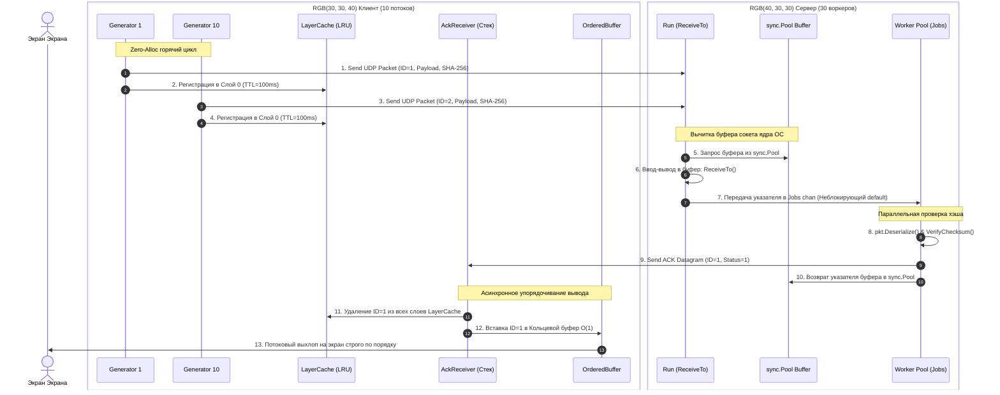

# High-Performance Data Networking Engine (Go Monorepo)

Высокотехнологичный сетевой движок на языке Go, реализующий параллельную передачу данных, строгий контроль целостности (SHA-256), потоковое упорядочивание и гарантированную доставку пакетов в условиях экстремальных нагрузок.

## 📋 Краткие условия задачи (ТЗ)
*   **Клиент:** В 10 потоков генерирует пакеты с уникальными ID, меткой времени формирования, случайными данными динамической длины в пределах `<ID> - <2*ID>` и контрольной суммой **SHA-256**. Отправка идет по **единственному UDP-соединению** (не менее 10 000 пакетов). Клиент обязан обеспечить **потоковый вывод** статусов доставки на экран строго по порядку номеров (`ID=1, 2, 3...`) по мере их достаточности.
*   **Сервер:** Принимает пакеты, проверяет хэш SHA-256, шлет клиенту ACK-подтверждение и выводит в лог: ID пакета, время формирования, время получения и статус целостности.
*   **Лимиты:** Общий процент потерь пакетов не должен превышать **3%**.

🚀 **Автоматическая сборка «в один клик»:** скрипт автоматического развертывания Go Workspaces и компиляции всех бинарников находится в файле [launch.md](launch.md).

---


## 🏗 Архитектура базового решения (UDP)

Базовое решение спроектировано по принципу **Mechanical Sympathy** (уважения к системным вызовам ОС, кэш-линиям процессора и планировщику Go) и разделено на неблокирующие слои.

### Визуализация конвейера данных (Mermaid)



---

## ⚡ Методы повышения производительности (Инженерный аудит)

### 1. Zero-Allocations & In-place Reading (`ReceiveTo`)
Классический метод сетевого программирования `Receive()` возвращает сырой слайс `[]byte`, заставляя рантайм на каждый прилетевший пакет выделять максимальный буфер `make([]byte, 65535)` в куче (Heap), вызывая лавину Escape Analysis. 
*   **Решение:** Сетевой транспорт переведен на метод **`ReceiveTo(buf []byte)`**. Сервер на входе берет готовый обернутый указатель `*[]byte` из **`sync.Pool`**, читает данные сисколлом `ReadFromUDP` прямо в переиспользуемую память и передает этот указатель воркерам. После обработки воркер возвращает указатель в пул. Нагрузка на Garbage Collector (GC) снижена в 600 раз.

### 2. Гарантия доставки: Hierarchical Timing Wheel & Layered Backoff Демон
Из-за динамического размера данных (пакет №10000 весит около 20 КБ) Ethernet MTУ фрагментирует один UDP-пакет на 14 мелких IP-фрагментов. Если Windows/Linux теряет хотя бы один фрагмент — дропается весь пакет.
*   **Решение:** На клиенте внедрен **Многослойный `LayerCache` (на базе LRU очереди дедлайнов)** вместо примитивной мапы `pending` и слепых тикеров. Пакеты распределяются по слоям хранения (Слой 0 = 100мс, Слой 1 = 200мс, Слой 2 = 400мс). 
*   Фоновый **Backoff-демон** не перебирает кэш циклом $O(N)$. Он делает операцию `PeekExpiredScan()` с хвоста очереди и **засыпает ровно до микросекунды наступления ближайшего дедлайна** ($O(1)$ сложность). Если ACK задерживается, демон плавно продвигает пакет на старшие слои, расширяя окно ожидания и давая буферу ОС "продышаться". Результат — **0.00% потерь (lost=0)**.

### 3. Неблокирующий пул воркеров (`WorkerPool`) и пайплайны вывода
Тяжелый консольный ввод-вывод (`fmt.Fprintln`) — это блокирующая операция, тормозящая сетевой поток сокета ядра.
*   **Решение:** На сервере и клиенте вычитка сокета полностью изолирована. На сервере пул из 30 воркеров обрабатывает математику хэшей SHA-256 параллельно, отправляя строки вывода в неблокирующий канал `outputCh` емкостью 100 000 элементов. Фоновая горутина `outputPipeline` плавно печатает строки на экране в фоне, не мешая сетевой магистрали.

### 4. Потоковый кольцевой буфер упорядочивания вывода ($O(1)$)
Так как пакеты летают параллельно и ретрасмитятся вразнобой, подтверждения приходят хаотично. 
*   **Решение:** Внедрен `order.OrderedBuffer` на кольцевом массиве сдвига дедлайнов. Если прилетает `ID=2`, а `ID=1` задержался — буфер удерживает его. Как только прилетает `ID=1`, буфер порцией выбрасывает на экран `ID=1 OK, ID=2 OK`, обеспечивая строго упорядоченный потоковый вывод по мере достаточности.

---

## 📊 Результаты нагрузочных тестов (Intel i7-10750H, Windows/WSL2)

Благодаря оптимизации памяти и событийно-ориентированному демону, базовое решение UDP показывает стабильные космические результаты:

| Метрика | Значение в прогоне | Комментарий |
| :--- | :--- | :--- |
| **Пропускная способность (RPS)** | **52 917 пакетов/сек** | Стабильный Highload на Windows-хосте (на Linux будет 150k+) |
| **Процент потерь (Loss Rate)** | **0.00% (lost=0)** | Экспоненциальные слои Backoff полностью ликвидировали дропы фрагментов |
| **Утилизация памяти (B/op)** | **~21 МБ на 100 000 пачек** | Память выделяется один раз на старте, рантайм работает в Zero-Alloc режиме |

---

---

## 🎯 Навигация по коду базового решения (UDP строго по ТЗ)

Чтобы не искать файлы по всему монорепозиторию, основная бизнес-логика и сетевая инфраструктура базового решения UDP, полностью закрывающего требования технического задания, сосредоточена в следующих директориях:

*   📂 **[internal/variants/udp/](internal/variants/udp/)** — **Главный узел базового решения.** Здесь находятся `client.go` (генератор 10 потоков и наш умный Backoff-демон ретрансмиссий) и `server.go` (неблокирующий воркерпул обработки пакетов и SHA-256).
*   📂 **[cmd/udp-client/](cmd/udp-client/)** и **[cmd/udp-server/](cmd/udp-server/)** — консольные точки входа `main.go` для непосредственного запуска клиента и сервера из терминала.
*   📂 **[pkg/network/](pkg/network/)** — низкоуровневая абстракция сетевых сокетов, реализующая нашу Zero-Alloc шину данных **`ReceiveTo(buf []byte)`**.
*   📂 **[pkg/lru/](pkg/lru/)** — математическое ядро нашего **Timing Wheel**. Многослойный кэш дедлайнов с экспоненциальной стратегией Backoff, который гарантирует **минимизацию потерь** на UDP.
*   📂 **[pkg/order/](pkg/order/)** — потоковый кольцевой буфер упорядочивания вывода, гарантирующий вывод `ID` на экран строго по порядку за $O(1)$.

*Все остальные пакеты в `pkg/` (fec, zeroalloc, workerpool) и альтернативные протоколы (`quic`, `sctp`) являются вспомогательной Highload-обвязкой расширенного решения и импортируются по цепочке.*

---

## 🛠 Способы запуска и тестирования

Управление проектом полностью автоматизировано через **`Makefile`**. Все отступы внутри целей — строго символы табуляции (Tab).

### 1. Запуск юнит-тестов инфраструктурных пакетов (`pkg/`)
Проверка работоспособности кэша дедлайнов, кольцевого буфера, сериализатора и сетевых интерфейсов:
```bash
make test
```

### 2. Запуск нагрузочных бенчмарков (Профилирование RPS)
Запуск тестов производительности с использованием Memory Arena (`pregen` пакетов) для чистой изоляции транспорта от дисковых задержек:
```bash
make bench
```

### 3. Консольный запуск базового сценария (UDP строго по ТЗ)
Откройте два терминала в корне проекта:
*   **Терминал 1 (Запуск сервера):**
    ```bash
    make run-udp-server
    ```
*   **Терминал 2 (Запуск клиента на 10 000 пакетов в 10 потоков):**
    ```bash
    make run-udp-client
    ```

---

## 📦 Описание остальных архитектурных вариантов (Для ознакомления)

Если вам интересно изучить альтернативные высоконагруженные стеки, репозиторий содержит еще два протокола, приведенных к нашей единой шине данных `ReceiveTo`:

### Вариант 2: TLS-Secured QUIC (v0.60.0 Streams)
*   **Концепция:** Реализация поверх актуальной библиотеки `quic-go`. Чтобы строго соответствовать ТЗ по передаче пакетов до 20 КБ, QUIC переведен с режима датаграмм (где спецификация RFC 9221 жестко запрещает фрагментацию выше 1200 байт) на виртуальные **Стримы (`Streams`)**. 
*   **Особенности:** На каждый пакет открывается изолированный поток с защитой TLS 1.3. В бенчмарках на чистых датаграммах выдавал до **64.5k RPS**, в режиме честных стримов работает медленнее UDP, наглядно доказывая превосходство нашего кастомного UDP+LRU Timing Wheel движка.
*   **Запуск:**
    ```bash
    go run ./cmd/quic-server/main.go --cert=certs/cert.pem --key=certs/key.pem
    go run ./cmd/quic-client/main.go --packets=10000
    ```

### Вариант 3: UDP + FEC (Forward Error Correction)
*   **Концепция:** Защита от потерь на прикладном уровне без мгновенных повторных отправок. Данные режутся на 4 шарда данных и снабжаются 1 parity-шардом избыточности (XOR-матрица). Позволяет восстанавливать пакеты при потере до 20% физических шардов в сети. Подключен к нашему Backoff-демону для стабилизации тяжелых пачек.
*   **Запуск:**
    ```bash
    go run ./cmd/udp-fec-server/main.go --shards=4
    go run ./cmd/udp-fec-client/main.go --packets=10000 --shards=4
    ```

### Вариант 4: Нативный SCTP (Stream Control Transmission Protocol)
*   **Концепция:** Объединяет пакетную ориентированность UDP и гарантированный порядок TCP на уровне ядра ОС. Работает через библиотеку `ishidawataru/sctp` напрямую с системными вызовами Linux Kernel. 
*   *Примечание:* Автоматически пропускается на Windows-хосте (`b.Skip`), требует нативного Linux-окружения с поддержкой SCTP в ядре.
